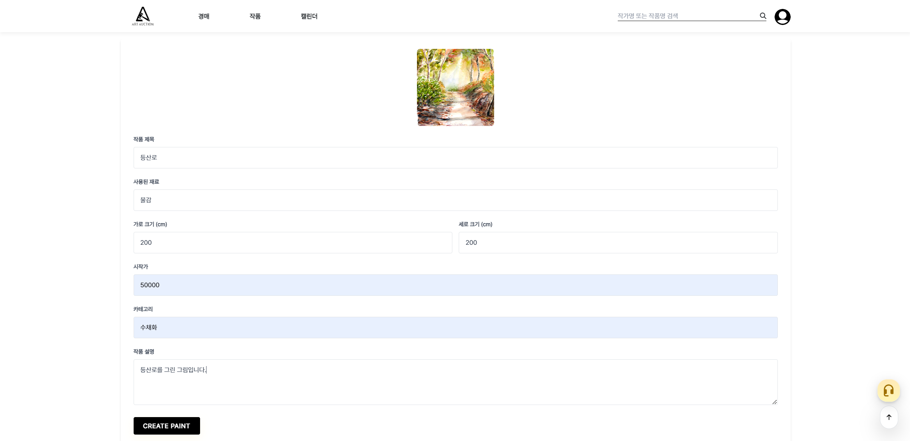

<p align="center">
   
</p>

# 온라인 미술품 경매 사이트
<br><br>
# 🚩 프로젝트 정보
- 웹 URL : https://www.a-auc.art/
- DB PORT : 3306
- DB username : root
- 데이터베이스 이름 : ArtAuction_db

# 💬 프로젝트 설명
- 미술 작품을 온라인에서 경매를 통해 구매(입찰)/판매 하는 기능 제공
- 검증된 아티스트와 손수 작업된 작품을 전시하고 소장을 위한 경매 제공
- 투명한 경매, 공정한 거래, 안전한 작품 이전을 목표로 둠

# 💨 개발 기간
- 2024 7.15 ~ 2024 9.3

# 🛠 개발 환경
- 운영체제 : Windows 10, 11
- 통합개발환경(IDE) : IntelliJ
- JDK 버전 : JDK 21
- 데이터 베이스 : MySQL
- 빌드 툴 : Gradle
- 관리 툴 : GitHub
- 배포 툴 : Nginxproxymanager, Termius

# ✨ Dependencies
- Spring Boot DevTools
- Lombok
- Spring Data JPA
- MariaDB Driver
- Spring Security
- Spring Web
- Oauth2-client
- Thymeleaf
- Validation
- spring boot starter mail
- Toss Payments
- daumcdn 주소 찾기(다음 카카오 API)

# 💻 기술 스택

### Version Control
<div>
    
    
</div>

### Backend Technologies
<div>
    
    
    
    
</div>

### Frontend Technologies
<div>
    
    
    
    
    
    
    
</div>

### Databases
<div>
    
    
</div>


# 👥 개발 팀원
|                                                               **임재원**                                                               |                                                                **박지완**                                                                |                                                               **김민섭**                                                                |                                                               **김채연**                                                                |
|:-----------------------------------------------------------------------------------------------------------------------------------:|:-------------------------------------------------------------------------------------------------------------------------------------:|:------------------------------------------------------------------------------------------------------------------------------------:|:------------------------------------------------------------------------------------------------------------------------------------:|
| [ <br/> @maegon](https://github.com/maegon) | [ <br/> @tron0318](https://github.com/tron0318) | [ <br/> @kimminseop99](https://github.com/kimminseop99) | [ <br/> @kim-chaeyeon](https://github.com/kim-chaeyeon) |

# 👨‍💻 역할 분담
### 🤓 임재원
+ UI, 페이지
  - 로그인, 회원가입, 계정찾기(아이디 찾기, 비밀번호 찾기)
  - 관리자(경매 내역 관리, 신청된 경매 작품 확인, 회원 권한 설정)
+ 기능
  - 소셜 계정으로 로그인 기능
  - 회원가입을 통한 로그인
  - 회원 가입 시 이메일 인증, 카카오 API를 통한 주소 입력
  - 이메일 발송을 통한 아이디 찾기
  - 이메일 발송을 통한 임시 비밀번호 발급(비밀번호 찾기)
  - 경매 내역 리스팅 및 관리
  - 작가가 신청한 작품 리스팅 및 관리
  - 회원 리스팅 및 관리
  - 회원의 권한(role)을 관리자가 변경하여 관리(role 값은 admin, artist, member로 나뉨)


### 💪 박지완
+ UI, 페이지
  - 마이페이지 (회원정보, 정보수정, 찜, 입찰내역, 낙찰내역, 문의내역)
  - 문의, FAQ(자주찾는질문)
  - 관리자(자주찾는질문 관리, 고객문의관리)
  - 회사소개
+ 기능
  - 정보수정(회원 정보,배송지수정)
  - FAQ(자주찾는질문 생성, 삭제, 리스팅 (관리자만가능))
  - 문의하기,답변(고객이 문의를하면 관리자가 답변하는방식)
  - 찜 기능(작품옆에 하트버튼을누르면 색이채워져 관심상품으로 확인)
  - 채팅(channel.io Api 를 이용해 고객과 상담사(관리자) 실시간채팅구현)
  - 마이페이지 리스팅
    - 입찰내역(입찰한상품의 가격정보,나의입찰 가격정보 확인 경매중이면 경매중 경매종료면 낙찰여부확인가능)
    - 낙찰내역(낙찰성공한 상품의 정보확인후 주문페이지로 이동가능)
    - 문의내역(자신이 문의한 내역,관리자가 답변을하면 처리완료로 상태변경)
    - 찜(자신의 관심상품 나열)


### 🐌 김채연
+ UI, 페이지
  - 작가(프로필, 약관 동의 및 작가 신청, 작가 리스트, 즐겨찾기)
  - 작품(개인 작품 리스트, 경매 등록 신청)
  - 관리자(작가 신청 승인, 경매 작품 등록 승인, 승인 리스트 관리)
+ 기능
  - 프로필(승인 후 프로필 작성 가능, 입력 필드 추가, 개인 작품 리스트로 이동)
  - 약관 동의(작가신청- 증빙 파일 업로드 및 승인 요청)
  - 작가 리스트 및 즐겨찾기 관리(작가 리스트에서 즐겨찾기 추가/취소 시 즐겨찾기한 작가 리스트에 자동 반영)
  - 개인 작품 리스트(해당 작가의 작품만 조회 가능, 작가- 자신의 작품만 경매 등록 버튼 표시)
  - 작품 경매 신청(경매 신청 시 버튼이 사라짐)
  - 승인 리스트(작가 및 경매 작품 승인/거절 관리)
    - 작가 승인 리스트(승인하면 승인 완료 목록에 작가가 뜸)
    -  경매 신청 작품 승인 리스트(경매 작품을 거절하면 해당 작품은 삭제됨)
   
### 🕴️ 김민섭
+ UI, 페이지
  - 메인페이지
  - 검색
  - 캘린더
  - 충전
  - 주문
  - 배송
  - 작품
  - 경매, 경매 가이드
  - 관리자(경매 추가)
  - 작가(작품 추가)
  - 그림판
+ 기능
  - 메인페이지 (진행중인 경매, 예정된 경매, 추천 작가, 가이드)
  - 검색 (작가 및 작품 검색 가능)
  - 캘린더 (예약 경매 표시)
  - 충전 (tossPayment 사용, 정해진 단위 또는 직접 입력금액으로 결제 가능)
  - 주문 (낙찰된 작품의 정보, 낙찰자의 정보, 송장번호 확인 가능)
  - 배송 (예상 배송일 확인 가능)
  - 작품 (작품의 현재가 순, 최신순으로 정렬 가능 작가이름 또는 작품이름으로 검색 가능)
  - 경매 (경매 응찰, 응찰 취소, 낙찰)
  - 경매추가 (등록된 작품 중 이밎 경매에 등록된 작품과 낙찰 끝난 작품을 제외한 작품 올리기 가능)
  - 작품추가 (작품의 정보 입력 후 유효성 검사를 거쳐 작품 등록 가능)
  - 알림 (예정된 경매 1시간전 알림메일, 경매가 끝난 후 작가, 낙찰자, 응찰자에게 경매 결과 알림메일)
  - 그림판 (붓, 지우개 크기조절 가능 그림 저장 가능)

# 🗃️ ER 다이어그램


# 📑 사용자 요구사항 명세서 [Notion](https://www.notion.so/aa74ac5296904e0d8b3bd8b5961408c6?v=bea59306a5964c9fbf44a8220f6476aa&pvs=4 "사용자 요구사항 명세서")


# 🗂️ 프로젝트 구조

```
└─src
    ├─main
    │  ├─generated
    │  ├─java
    │  │  └─com
    │  │      └─example
    │  │          └─ArtAuction_24
    │  │              │  ArtAuction24Application.java
    │  │              │
    │  │              ├─domain
    │  │              │  ├─answer
    │  │              │  │  ├─controller
    │  │              │  │  │      AnswerController.java
    │  │              │  │  │
    │  │              │  │  ├─entity
    │  │              │  │  │      Answer.java
    │  │              │  │  │
    │  │              │  │  ├─repository
    │  │              │  │  │      AnswerRepository.java
    │  │              │  │  │
    │  │              │  │  └─service
    │  │              │  │          AnswerService.java
    │  │              │  │
    │  │              │  ├─artist
    │  │              │  │  ├─controller
    │  │              │  │  │      ArtistController.java
    │  │              │  │  │
    │  │              │  │  ├─entity
    │  │              │  │  │      Artist.java
    │  │              │  │  │      ArtistAdd.java
    │  │              │  │  │      ContentAdd.java
    │  │              │  │  │      ContentAddBase.java
    │  │              │  │  │      HeightContentAdd.java
    │  │              │  │  │      TechniqueContentAdd.java
    │  │              │  │  │      TitleAdd.java
    │  │              │  │  │      TitleContentAdd.java
    │  │              │  │  │      UnitContentAdd.java
    │  │              │  │  │      WidthContentAdd.java
    │  │              │  │  │      YearContentAdd.java
    │  │              │  │  │
    │  │              │  │  ├─form
    │  │              │  │  │      ArtistForm.java
    │  │              │  │  │
    │  │              │  │  ├─repository
    │  │              │  │  │      ArtistAddRepository.java
    │  │              │  │  │      ArtistRepository.java
    │  │              │  │  │      ContentAddRepository.java
    │  │              │  │  │      HeightContentAddRepository.java
    │  │              │  │  │      TechniqueContentAddRepository.java
    │  │              │  │  │      TitleAddRepository.java
    │  │              │  │  │      TitleContentAddRepository.java
    │  │              │  │  │      UnitContentAddRepository.java
    │  │              │  │  │      WidthContentAddRepository.java
    │  │              │  │  │      YearContentAddRepository.java
    │  │              │  │  │
    │  │              │  │  └─service
    │  │              │  │          ArtistService.java
    │  │              │  │
    │  │              │  ├─auction
    │  │              │  │  ├─controller
    │  │              │  │  │      AuctionApiController.java
    │  │              │  │  │      AuctionController.java
    │  │              │  │  │      CalendarPageController.java
    │  │              │  │  │
    │  │              │  │  ├─entity
    │  │              │  │  │      Auction.java
    │  │              │  │  │      AuctionStatus.java
    │  │              │  │  │
    │  │              │  │  ├─form
    │  │              │  │  │      AuctionForm.java
    │  │              │  │  │
    │  │              │  │  ├─repository
    │  │              │  │  │      AuctionRepository.java
    │  │              │  │  │
    │  │              │  │  └─service
    │  │              │  │          AuctionService.java
    │  │              │  │
    │  │              │  ├─bid
    │  │              │  │  ├─controller
    │  │              │  │  │      BidController.java
    │  │              │  │  │
    │  │              │  │  ├─entity
    │  │              │  │  │      Bid.java
    │  │              │  │  │      KeyValues.java
    │  │              │  │  │
    │  │              │  │  ├─repository
    │  │              │  │  │      BidRepository.java
    │  │              │  │  │
    │  │              │  │  └─service
    │  │              │  │          BidService.java
    │  │              │  │
    │  │              │  ├─chat
    │  │              │  │  ├─chatMessage
    │  │              │  │  │  └─service
    │  │              │  │  │          ChatMessageService.java
    │  │              │  │  │
    │  │              │  │  └─chatRoom
    │  │              │  │      ├─controller
    │  │              │  │      │      ChatRoomController.java
    │  │              │  │      │
    │  │              │  │      └─entity
    │  │              │  │              ChatRoom.java
    │  │              │  │
    │  │              │  ├─deliver
    │  │              │  │  ├─controller
    │  │              │  │  │      DeliverController.java
    │  │              │  │  │
    │  │              │  │  ├─deliverRepository
    │  │              │  │  │      DeliveryRepository.java
    │  │              │  │  │
    │  │              │  │  ├─entity
    │  │              │  │  │      Delivery.java
    │  │              │  │  │      DeliveryStatus.java
    │  │              │  │  │
    │  │              │  │  └─service
    │  │              │  │          DeliveryService.java
    │  │              │  │
    │  │              │  ├─home
    │  │              │  │      AdmHomeController.java
    │  │              │  │      HomeController.java
    │  │              │  │      SearchController.java
    │  │              │  │
    │  │              │  ├─member
    │  │              │  │  ├─controller
    │  │              │  │  │      MemberController.java
    │  │              │  │  │
    │  │              │  │  ├─dto
    │  │              │  │  │      ApiResponse.java
    │  │              │  │  │      DailyVisitorData.java
    │  │              │  │  │      MemberUpdateRequest.java
    │  │              │  │  │
    │  │              │  │  ├─entity
    │  │              │  │  │      Member.java
    │  │              │  │  │      MemberRole.java
    │  │              │  │  │
    │  │              │  │  ├─form
    │  │              │  │  │      MemberAddressForm.java
    │  │              │  │  │      MemberForm.java
    │  │              │  │  │      MemberModifyForm.java
    │  │              │  │  │
    │  │              │  │  ├─repository
    │  │              │  │  │      MemberRepository.java
    │  │              │  │  │
    │  │              │  │  └─service
    │  │              │  │          MemberService.java
    │  │              │  │
    │  │              │  ├─notification
    │  │              │  │  ├─entity
    │  │              │  │  │      Notification.java
    │  │              │  │  │
    │  │              │  │  ├─repository
    │  │              │  │  │      NotificationRepository.java
    │  │              │  │  │
    │  │              │  │  └─service
    │  │              │  │          NotificationService.java
    │  │              │  │
    │  │              │  ├─order
    │  │              │  │  ├─controller
    │  │              │  │  │      OrderController.java
    │  │              │  │  │
    │  │              │  │  ├─entity
    │  │              │  │  │      Order.java
    │  │              │  │  │      OrderStatus.java
    │  │              │  │  │
    │  │              │  │  ├─repository
    │  │              │  │  │      OrderRepository.java
    │  │              │  │  │
    │  │              │  │  └─service
    │  │              │  │          OrderService.java
    │  │              │  │
    │  │              │  ├─post
    │  │              │  │  ├─controller
    │  │              │  │  │      PostController.java
    │  │              │  │  │
    │  │              │  │  ├─entity
    │  │              │  │  │      Post.java
    │  │              │  │  │      PostType.java
    │  │              │  │  │
    │  │              │  │  ├─form
    │  │              │  │  │      PostForm.java
    │  │              │  │  │
    │  │              │  │  ├─repository
    │  │              │  │  │      PostRepository.java
    │  │              │  │  │
    │  │              │  │  └─service
    │  │              │  │          PostService.java
    │  │              │  │
    │  │              │  ├─product
    │  │              │  │  ├─controller
    │  │              │  │  │      AuctionProductController.java
    │  │              │  │  │      ExhibitionProductController.java
    │  │              │  │  │      ProductController.java
    │  │              │  │  │
    │  │              │  │  ├─entity
    │  │              │  │  │      AuctionProduct.java
    │  │              │  │  │      ExhibitionProduct.java
    │  │              │  │  │      LikeProduct.java
    │  │              │  │  │      Product.java
    │  │              │  │  │
    │  │              │  │  ├─form
    │  │              │  │  │      ProductAuctionForm.java
    │  │              │  │  │      ProductForm.java
    │  │              │  │  │
    │  │              │  │  ├─repository
    │  │              │  │  │      AuctionProductRepository.java
    │  │              │  │  │      ExhibitionProductRepository.java
    │  │              │  │  │      LikeProductRepository.java
    │  │              │  │  │      ProductRepository.java
    │  │              │  │  │
    │  │              │  │  └─service
    │  │              │  │          AuctionProductService.java
    │  │              │  │          ExhibitionProductService.java
    │  │              │  │          ProductService.java
    │  │              │  │
    │  │              │  └─question
    │  │              │      ├─controller
    │  │              │      │      QuestionController.java
    │  │              │      │
    │  │              │      ├─entity
    │  │              │      │      Question.java
    │  │              │      │      QuestionStatus.java
    │  │              │      │      QuestionType.java
    │  │              │      │
    │  │              │      ├─form
    │  │              │      │      QuestionForm.java
    │  │              │      │
    │  │              │      ├─repository
    │  │              │      │      QuestionRepository.java
    │  │              │      │
    │  │              │      └─service
    │  │              │              QuestionService.java
    │  │              │
    │  │              ├─global
    │  │              │  │  DataNotFoundException.java
    │  │              │  │  ProfanityFilter.java
    │  │              │  │
    │  │              │  ├─base
    │  │              │  │  ├─controller
    │  │              │  │  │      GlobalControllerAdvice.java
    │  │              │  │  │
    │  │              │  │  ├─entity
    │  │              │  │  │      BaseEntity.java
    │  │              │  │  │
    │  │              │  │  └─initData
    │  │              │  │          BeforeInitData.java
    │  │              │  │          DevInitData.java
    │  │              │  │          ProdInitData.java
    │  │              │  │          TestInitData.java
    │  │              │  │
    │  │              │  ├─config
    │  │              │  │      WebMvcConfig.java
    │  │              │  │
    │  │              │  ├─customException
    │  │              │  │      CustomDuplicateEmailException.java
    │  │              │  │
    │  │              │  ├─email
    │  │              │  │      EmailController.java
    │  │              │  │      EmailMessage.java
    │  │              │  │      EmailRequestDto.java
    │  │              │  │      EmailResponseDto.java
    │  │              │  │      EmailService.java
    │  │              │  │
    │  │              │  └─security
    │  │              │          CustomOAuth2User.java
    │  │              │          CustomOAuth2UserService.java
    │  │              │          SecurityConfig.java
    │  │              │          UserSecurityService.java
    │  │              │
    │  │              └─recharge
    │  │                  ├─controller
    │  │                  │      RechargeController.java
    │  │                  │      RechargeViewController.java
    │  │                  │
    │  │                  ├─entity
    │  │                  │      Recharge.java
    │  │                  │
    │  │                  ├─exception
    │  │                  │      GlobalExceptionHandler.java
    │  │                  │
    │  │                  ├─repository
    │  │                  │      RechargeRepository.java
    │  │                  │
    │  │                  └─service
    │  │                          RechargeService.java
    │  │
    │  └─resources
    │      │  application-dev.yml
    │      │  application-prod.yml
    │      │  application-secret.yml
    │      │  application-secret.yml.defualt
    │      │  application-test.yml
    │      │  application.yml
    │      │
    │      ├─static
    │      │  │  favicon.ico
    │      │  │
    │      │  ├─css
    │      │  │  ├─admin
    │      │  │  │  ├─member
    │      │  │  │  │      list.css
    │      │  │  │  │
    │      │  │  │  └─question
    │      │  │  │          faqManage.css
    │      │  │  │          questionManage.css
    │      │  │  │
    │      │  │  ├─auction
    │      │  │  │      list.css
    │      │  │  │      scheduled.css
    │      │  │  │
    │      │  │  ├─common
    │      │  │  │      .login.css.swp
    │      │  │  │      artDetail.css
    │      │  │  │      artForm.css
    │      │  │  │      artist.css
    │      │  │  │      artistList.css
    │      │  │  │      artList.css
    │      │  │  │      base.css
    │      │  │  │      favoriteArtists.css
    │      │  │  │      footer.css
    │      │  │  │      header.css
    │      │  │  │      layout.css
    │      │  │  │      myPage.css
    │      │  │  │      pendingApprovals.css
    │      │  │  │      product.css
    │      │  │  │      productAuctionForm.css
    │      │  │  │      profile.css
    │      │  │  │      profileForm.css
    │      │  │  │      proofUploadForm.css
    │      │  │  │      terms.css
    │      │  │  │      uploadedConfirmation.css
    │      │  │  │
    │      │  │  ├─login
    │      │  │  │      login.css
    │      │  │  │
    │      │  │  ├─main
    │      │  │  │      introduce.css
    │      │  │  │      main.css
    │      │  │  │
    │      │  │  └─product
    │      │  │          detail.css
    │      │  │
    │      │  ├─images
    │      │  │  │  공통 이미지
    │      │  │  │
    │      │  │  ├─artist
    │      │  │  │      작가 프로필 이미지
    │      │  │  │
    │      │  │  ├─functionImage
    │      │  │  │      페이지별 이미지
    │      │  │  │
    │      │  │  ├─images
    │      │  │  │  ├─artist
    │      │  │  │  └─product
    │      │  │  ├─member
    │      │  │  │		회원 프로필 이미지
    │      │  │  ├─pdf
    │      │  │  │  └─proofs
    │      │  │  │          예술활동증명서.pdf
    │      │  │  │
    │      │  │  ├─product
    │      │  │  │      작품 이미지
    │      │  │  │
    │      │  │  ├─proofs
    │      │  │  │      작가 증빙 파일.hwpx
    │      │  │  │
    │      │  │  └─question
    │      │  │          질문 이미지
    │      │  │
    │      │  ├─js
    │      │  │  ├─admin
    │      │  │  │  ├─global
    │      │  │  │  │      menuBar.js
    │      │  │  │  │
    │      │  │  │  ├─member
    │      │  │  │  │      list.js
    │      │  │  │  │
    │      │  │  │  └─product
    │      │  │  │          list.js
    │      │  │  │
    │      │  │  ├─auction
    │      │  │  │      calendar.js
    │      │  │  │      list.js
    │      │  │  │      scheduled.js
    │      │  │  │
    │      │  │  ├─bid
    │      │  │  │      bid.js
    │      │  │  │
    │      │  │  ├─chat
    │      │  │  │      chat.js
    │      │  │  │
    │      │  │  ├─common
    │      │  │  │      footer.js
    │      │  │  │      header.js
    │      │  │  │      join.js
    │      │  │  │      layout.js
    │      │  │  │      login.js
    │      │  │  │      recharge.js
    │      │  │  │
    │      │  │  ├─main
    │      │  │  │      main.js
    │      │  │  │
    │      │  │  └─product
    │      │  │          detail.js
    │      │  │          list.js
    │      │  │
    │      │  └─pdf
    │      │      │  ArtAuction이용약관.pdf
    │      │      │
    │      │      └─proofs
    │      │              2__임재원 출석부(07).pdf
    │      │              2__작가증빙.zip
    │      │              4__예술활동증명서.pdf
    │      │              6__임재원 출석부(07).pdf
    │      │
    │      ├─staticimage
    │      │  └─profileImageUpload
    │      │          작가프로필.png
    │      │
    │      └─templates
    │          ├─admin
    │          │  ├─auction
    │          │  │      list.html
    │          │  │
    │          │  ├─member
    │          │  │      list.html
    │          │  │
    │          │  ├─product
    │          │  │      list.html
    │          │  │
    │          │  └─question
    │          │          faqManage.html
    │          │          faqWrite.html
    │          │          manage.html
    │          │
    │          ├─artist
    │          │      artistForm.html
    │          │      artistList.html
    │          │      error.html
    │          │      favoriteArtists.html
    │          │      noProfile.html
    │          │      pendingApprovals.html
    │          │      profile.html
    │          │      profileForm.html
    │          │      proofUploadForm.html
    │          │      termsForm.html
    │          │      uploadedConfirmation.html
    │          │
    │          ├─auction
    │          │      form.html
    │          │      list.html
    │          │      scheduled.html
    │          │      scheduledDetail.html
    │          │
    │          ├─calendar
    │          │      view.html
    │          │
    │          ├─error
    │          │      artistNotFound.html
    │          │      form_errors.html
    │          │
    │          ├─home
    │          │      howToBuy.html
    │          │      howToSell.html
    │          │      introduce.html
    │          │      main.html
    │          │      paint.html
    │          │      search_result.html
    │          │
    │          ├─layout
    │          │      footer.html
    │          │      header.html
    │          │      layout.html
    │          │
    │          ├─member
    │          │      deliverDetail.html
    │          │      findId.html
    │          │      findPw.html
    │          │      login.html
    │          │      myPage.html
    │          │      orderDetail.html
    │          │
    │          ├─product
    │          │      auctionList.html
    │          │      detail.html
    │          │      form.html
    │          │      list.html
    │          │      modifyform.html
    │          │      myProducts.html
    │          │      productAuctionForm.html
    │          │
    │          ├─question
    │          │      detail.html
    │          │      list.html
    │          │      write.html
    │          │
    │          └─recharge
    │                  fail.html
    │                  recharge.html
    │                  success.html
    │
    └─test
        └─java
            └─com
                └─example
                    └─ArtAuction_24
                            ArtAuction24ApplicationTests.java

```


# 👤 주요 기능
<details>
   <summary>🖼️ 경매 기능</summary>
   <br/>

   ### 1. 작가가 자신의 작품을 경매에 내놓기 위해 관리자에게 경매 신청을 합니다.
   
   <br><br>

   ### 2. 관리자는 신청된 작품을 보고 검수합니다.
   
   <br><br>

   ### 3. 검토가 완료되면 관리자는 해당 제품을 경매에 내놓습니다.
   
   <br><br>

   ### 4. 사용자는 경매 페이지에서 진행 중인 경매 작품들을 확인할 수 있습니다.
   
   <br><br>

   ### 5. 경매 응찰을 하기 전 (다른 사용자가 이미 입찰 금액을 제시한 상황)
   
   <br><br>

   ### 6. 경매 응찰을 하고 난 후
   
   <br><br>

   ### 7. 사용자의 마이페이지에서 경매 입찰 목록을 확인할 수 있습니다.
   
   <br><br>

   ### 8. 경매가 종료되고 낙찰자로 선정이 되면 낙찰 목록에서 확인할 수 있습니다.
   
   <br><br>

</details>


<details>
   <summary>🔔 알림 기능</summary>
   <br/>

  -  <details>
      <summary>📨 경매 관련 알림 설정 및 시작 알림</summary>
      <br/>

      ### 1. 사용자는 예정된 경매의 상세 페이지에서 알림 설정을 할 수 있습니다.
      
      <br><br>

      ### 2. 사용자의 개인 메일로 경매 시작 1시간 전 경매 시작 알림 메일이 발송됩니다.
      
      <br><br>
      
     </details>

 -   <details>
      <summary>🎉 경매 결과 알림</summary>
      <br/>

      ### 1. 해당 작품의 작가에게 축하 메일이 발송됩니다.
      
      <br><br>

      ### 2. 해당 작품을 낙찰한 낙찰자에게 축하 메일이 발송됩니다.
      
      <br><br>

      ### 3. 낙찰하지 못했지만 해당 작품의 경매에 참여한 참여자들에게 결과 알림 메일이 발송됩니다.
      
      <br><br>
   </details>

</details>

<details>
   <summary>👩‍🎨 작가 권한 부여</summary>
   <br/>
    
   ### 1. 사용자는 작가의 권한을 받기 위해 작가 신청을 할 수 있습니다.(이용약관 동의 및 증빙 자료 제출은 필수!!)
   
   <br><br>

   ### 2. 신청을 완료하면 관리자의 승인을 기다립니다.
   
   <br><br>

   ### 3. 관리자는 작가 신청 내역에서 증빙 자료를 확인하고 작가 승인을 허가해 줄 수 있습니다.
   
   <br><br>

   ### 4. 이 후 관리자는 회원 권한 설정 페이지에서 해당 회원에 작가의 권한을 부여해줄 수 있습니다.
   
   <br><br>

   ### 5. 작가권한을 받은 사용자는 작가 프로필을 생성할 수 있습니다.
   
   <br><br>

   ### 6. 작가 프로필을 생성하고나면 작가 개인 페이지가 생성됩니다.
   
   <br><br>

   ### 7. 작가는 자신의 작품을 등록할 수 있습니다.(작가 프로필을 생성 후 작품 등록 가능!!)
   
   <br><br>

</details>

# ⚙️ 페이지별 기능
<details>
   <summary>회원 가입</summary>
   <br/>

#### 1. 회원가입
- 아이디, 닉네임, 비밀번호, 비밀번호 확인, 전화번호, 이메일, 주소를 모두 작성하면 회원가입기능 버튼이 활성화됩니다.
- 비밀번호와 비밀번호 확인란의 문자열이 같지 않을 시에 회원가입이 불가능합니다.
- 아이디와 닉네임은 중복확인이 필요하며 이메일인증은 필수 입니다.
- 주소는 KaKao Api를 사용하여 쉽게 찾아볼 수 있습니다.

| 회원가입 |
|----------|
|  |
<br>

</details>

<details>
   <summary>로그인</summary>
   <br/>

#### 1. 로그인
 - 아이디와 비밀번호 입력시 해당 유저가 가입되어있으면 로그인 됩니다.
 - 아이디 저장을 체크하고 로그인을 하면 자동으로 아이디 정보가 저장됩니다.

#### 2. 아이디 및 비밀번호 찾기
 - 아이디와 비밀번호가 일치하지 않을때 일부 정보를 입력해서 찾기가 가능합니다.
 - 아이디 찾기는 계정의 메일 정보를 입력하면 해당 메일로 아이디 정보가 발송됩니다.
 - 비밀번호 찾기는 계정의 아이디와 메일 정보를 입력하면 해당 메일로 임시 비밀번호가 발송됩니다.

#### 3. 소셜 로그인
 - 카카오, 네이버, 구글로 소셜로그인이 가능합니다.

| 로그인 |
|----------|
|  |
<br>

</details>

<details>
   <summary>경매 페이지</summary>
   <br/>

#### 1. 진행중인 경매 리스팅
 - 경매 페이지에서는 현재 진행중인 경매 작품의 목록을 확인 할 수 있습니다.
 - 작품의 작가이름, 작품명, 크기, 사용재료, 현재가를 확인할 수 있습니다.
 - 예정된 경매가 활성화 되거나 진행중이였던 경매가 종료되면 경매 페이지에서 자동으로 사라집니다.
 - 작품의 상세보기를 클릭하면 각각의 작품의 상세정보가 포함되어 있으며 경매를 할 수 있는 페이지로 이동하게 됩니다.
 - 페이징 기능이 구현되어어 있어 16개 이상이 되면 자동으로 페이지가 추가됩니다.

#### 2. 정렬 및 검색
 - 올라온 작품들을 최신순, 가격이 높은순과 낮은순으로 확인할 수 있습니다.
 - 작품명을 검색하여 원하는 작품을 간편하게 찾을 수 있습니다.
 - 카테고리를 확인 및 클릭하면 경매 제목별로 작품을 정렬화해 볼 수 있습니다. 


| 경매 페이지 |
|----------|
|  |
<br>

</details>

<details>
   <summary>캘린더 페이지</summary>
   <br/>

#### 1. 예정된 경매 목록
 - 캘린더 페이지에서는 예정된 경매 목록을 확인 할 수 있습니다.
 - month, week, day별로 경매를 확인 할 수 있으며 today 버튼으로 현재 날짜를 확인 할 수 있습니다.
 - 경매바를 통해 예정된 경매의 시작시간을 확인할 수 있으며 경매 바 클릭시에 경애의 상세 페이지로 이동할 수 있습니다.

| 캘린더 페이지 |
|----------|
|  |
<br>

</details>

<details>
   <summary>작품 페이지</summary>
   <br/>

#### 1. 작품 목록
 - 모든 작품을 확인할 수 있으며 작품을 클릭하면 작품 상세 페이지로 이동됩니다.
 - 작품의 작가이름, 작품명, 크기, 사용재료, 현재가를 확인할 수 있습니다.
 - 페이징 기능이 구현되어 있어 16개 이상이 되면 자동으로 페이지가 추가됩니다. 

#### 2. 정렬 및 검색
 - 올라온 작품들을 최신순, 가격이 높은순과 낮은순으로 확인할 수 있습니다.
 - 작품명과 작가이름을 검색하여 원하는 작품을 간편하게 찾을 수 있습니다.

#### 3. 찜 기능
 - 원하는 작품의 하트 버튼을 누르면 찜 기능이 활성화됩니다.
 - 찜 한 작품은 마이페이지의 찜 메뉴에서 확인 가능합니다. 


| 작품 페이지 |
|----------|
|  |
<br>

</details>

<details>
   <summary>작가 페이지</summary>
   <br/>

#### 1. 작가 정보
 - 작가 페이지에서 작가의 정보(이름, 생년월일, 소개, 전화번호, 메일, 작가 작품 정보)를 확인 할 수 있습니다.
 - 작가 본인의 프로필 페이질 경우 소개와 작품 정보를 수정 할 수 있으며 작가 개인 프로필폼을 삭제 할 수 있습니다.

#### 2. 경매 작품 신청
 - 작가 본인의 계정일 경우 작가 프로필의 개인 작품 페이지에서 자신의 작품을 경매에 올릴 수 있습니다.
 - 경매 신청 작품에는 작품 올리기 버튼이 보이지 않습니다.  


| 작가 페이지 |
|----------|
|  |
<br>

</details>

<details>
   <summary>마이 페이지</summary>
   <br/>

#### 1. 정보 수정
 - 회원의 정보를 확인 하고 수정(닉네임, 비밀번호, 메일, 프로필 이미지, 배송주소) 할 수 있습니다.
 - 본인의 충전 금액을 확인 할 수 있습니다.
   

#### 2. 찜 메뉴
 - 작품 페이지에서 찜 하트를 누르면 찜 메뉴에서 확인할 수 있습니다.
 - 찜 메뉴에서 작품 보기를 누르면 해당 작품의 상세 페이지로 이동 할 수 있습니다.
 - 찜 작품의 정보를 확인 할 수 있습니다.

#### 3. 입찰 내역 메뉴
 - 현재 계정이 입찰중인 작품의 정보를 확인 할 수 있습니다.
 - 입찰 내역에 올라온 작품의 이미지를 클릭하면 입찰중인 작품의 상세 페이지로 이동됩니다.

#### 4. 낙찰 내역
 - 현재 계정이 낙찰한 작품의 정보를 확인 할 수 있습니다.
 - 낙찰된 날짜와 낙찰가를 확인 할 수 있습니다.
 - 주문 상세 페이지로 이동할 수 있습니다.
 - 주문 상세 페이지에서는 주문 정보와 낙찰자의 정보를 확인 할 수 있으며 배송 페이지로 이동가능합니다.
 - 배송 페이지에서는 현재 작품의 배송 정보를 확인 할 수 있습니다.

#### 5. 문의 내역
 - 자신이 문의한 문의 내역을 확인 할 수 있습니다.
 - 문의의 상태는 관리자가 답변을 작성해주지 않았을 경우 "처리 전" 답변을 작성 해주었을 경우 "처리 완료"가 됩니다.


| 마이 페이지 |
|----------|
|  |
<br>

</details>


# 🔥 트러블 슈팅
<details>
   <summary>김민섭</summary>
   <br/>
   
## 🚨 이슈
Calendar API를 사용하여 데이터를 화면에 표시하려고 했지만, 데이터는 정상적으로 보이지만 캘린더 뷰가 제대로 나타나지 않았습니다. 결과적으로 검은 화면에 데이터만 나타나는 문제가 발생했습니다. <br> <br>

## 🛑 원인
api/calendar에서 전달된 데이터 포맷과 캘린더 뷰를 나타내는 매핑이 혼합되어 있었기 때문에 페이지 URL에 접속했을 때 검은 화면에 데이터만 표시되었습니다. <br> <br>

## 🚥 해결
데이터와 캘린더 뷰를 명확히 구분하여 각각 별도의 매핑을 통해 문제를 해결했습니다. 데이터 처리와 뷰 렌더링을 독립적으로 관리하여 정상적으로 캘린더 뷰가 표시되도록 조정하였습니다.
</br></br>
</details>   

<details>
   <summary>임재원</summary>
   <br/>
   
## 🚨 이슈
회원가입폼의 이메일 인증 코드 발급 부분에서 이메일을 못 가져옴 <br> <br>

## 🛑 원인
회원가입폼과 관련된 memberForm 엔티티의 Email에 어노테이션으로 @NotBlank를 작성해 주었는데 인식을 못 함,<br> <br>

## 🚥 해결
memberForm 엔티티의 Email에 어노테이션으로 @NotBlank, @NotEmpty 둘다 안되서 @NotNull로 써주니 해결됨
</br></br>

## 🚨 이슈
배포환경에서 이미지 가져오질 못함 <br> <br>

## 🛑 원인
이미지 형태가 File형태로 들어가서 경로를 가져오지 못함,<br> <br>

## 🚥 해결
ProjectService의 create함수에 제약 사항으로 thumbnailFile.getParentFIle()이 존재하면 디렉토리를 만드는 것으로 추가하여 해결
</br></br>

</details>   

<details>
   <summary>박지완</summary>
   <br/>
   
## 🚨 이슈
채팅버튼이 특정페이지만 적용됨 <br> <br>

## 🛑 원인
api를이용해 제공받은 자바스크립트로 회원 데이터값을 넘겨줘야하는데 
회원 데이터값을 넘겨주지 않는 컨트롤러는 해당 템플릿에 회원데이터를 가져오지못해 버튼이안생김 <br> <br>

## 🚥 해결
해결방안으로 두가지를 생각해냄

첫번째로 내가원하는것은 템플릿에 회원값을 가져와 채팅Api에 연결을해주어야함 결국 로그인된 회원정보가 필요함 
GlobalController를 하나만들어 모든컨트롤러에 만약 로그인이되어있으면 그해당회원정보를 가져와 타임리프에 변수로 보내주어 공통템플릿(Layout)에 적용하여 (해결)

또하나 다른해결방법은 AOP라는 기술을찾음 첫번째방법과 비슷한개념으로 
서비스나 컨트롤러에서 공통로직을 좀더간결하고 걸러주는것인데 처음보는 코드와 개념을익히고 공부하기에는 프로젝트준비시간이 부족하여 팀원한테 피해끼치기싫어 프로젝트 끝나고 추후에 AOP를공부해보기로함
</br></br>
</details>   

# 🌱 개선 목표
## 1. 관리자 회원권한 설정
**문제점**: 회원의 활성/비활성 기능이 작동하지 않으며, 권한 설정 후 페이지 새로고침 시 접근 권한 오류가 발생하고, 권한 설정한 계정으로 자동 로그인되는 오류와 작품 페이지 접근 오류가 발생합니다.</br>

**개선 사항**: 회원 권한 설정 기능을 수정하여 활성/비활성 상태가 제대로 작동하도록 하고, 페이지 새로고침 후 접근 권한 오류를 해결합니다. 또한, 자동 로그인 문제를 방지하고, 작품 페이지 접근 오류를 수정하여 안정적인 사용자 권한 관리를 구현합니다.
</br></br>
## 2. 충전 후 URL 조작 방지
**문제점**: 충전 완료 후 URL에 충전액이 그대로 나타나는 문제가 발생합니다. URL을 조작하여 충전 금액을 부풀릴 수 있는 가능성이 있습니다.</br>

**개선 사항**: 토큰 사용, URL 파라미터 암호화, 그리고 결제 게이트웨이의 웹훅(Webhook) 사용을 통해 데이터 무결성을 보장하고 URL 조작을 방지합니다. 서버 측에서의 철저한 검증과 보안 강화가 필요합니다.
</br></br>
## 3. 소지금 환불 및 송금 기능 추가
**문제점**: 현재 충전은 결제 시스템만 구현되어 있으며, 환불이나 송금 기능이 없습니다.</br>

**개선 사항**: 환불 및 송금 시스템을 추가하여 사용자에게 더 나은 경험을 제공하도록 합니다. 경매 사이트나 결제 시스템에서 필요한 기능을 연구하고, 사용자에게 환불 및 송금 서비스를 제공하여 시스템의 완성도를 높입니다.
</br></br>
## 4. 반응형 웹페이지 개선
**문제점**: 대부분의 페이지는 반응형으로 설계되었지만, 모바일 환경에서 ul 구조가 사용자에게 불편하게 보일 수 있습니다.</br>

**개선 사항**: 모바일 환경에서도 사용자가 보기 편하도록 ul 구조와 다른 반응형 요소를 개선합니다. 모바일 화면에 맞게 레이아웃을 조정하고, 사용자 경험을 향상시킬 수 있도록 디자인을 수정합니다.
</br></br>
## 5. 다국어 지원 추가
**문제점**: Art_Auction은 현재 다국어 지원이 되어 있지 않아 해외 사용자들에게는 불편함이 있습니다.</br>

**개선 사항**: Google Cloud Translation API와 DeepL API와 같은 번역 API를 활용하여 다국어 지원 기능을 추가합니다. 이를 통해 국제적인 사용자들이 보다 원활하게 서비스를 이용할 수 있도록 합니다. 다국어 지원을 통해 글로벌 시장에서의 접근성을 높이는 것이 목표입니다.
</br></br>

</br></br>
# 👍 프로젝트 후기

### 🤓 임재원 
미숙한 저를 조장으로 만나 힘들었을 조원들에게 미안하고 고맙고 힘들 때 응원해주신 강사님을 비롯한 다른 조원의 조장분들에게 고맙고 프로젝트 마무리까지 함께 해줘서 고맙습니다. 마치 수상소감 말하듯 말하니 민망하네요. 히힣
</br></br>

### 💪 박지완 
처음으로 배포까지하는 프로젝트를하면서 로컬환경엔 문제없지만 배포하고나서 도메인에 문제가있는경우가 있었는데 
해결하려고 팀원들이 머리맞대면서 원인찾는모습이 마치 탐정놀이하는거같아서
되게재밌었어요 많은것을 배우게해준 팀원들 감사합니다
</br></br>

### 🐌 김채연 

</br></br>

### 🕴️ 김민섭
주제 선정과 기획부터 어려움이 있어 무사히 프로젝트를 끝낼 수 있을까 걱정도 많이 되었고 이전에 다뤄보지 않았던 새로운 시스템들을 구현해낼 수 있을까하는 우려도 적지 않았던 것 같습니다. 프로젝트 진행 중에도 시스템에 관한 변수나 예외가 지속적으로 발생했고 처리 능력이 부족하다보니 제가 맡은 부분에만 집중하게 되었고 때문에 팀원들에게 도움을 주지 못했던 것 같습니다. 그럼에도 팀원들이 각자 맡은 역활을 충분히 해 주었고 제가 부족한 부분도 팀원들이 채워주어 프로젝트를 무사히 끝낼 수 있었다고 생각합니다. 이번 프로젝트로 디자인이나 유용한 기능들을 많이 알아가는 것 같아 뜻 깊은 시간이 되었고 또 꼭 한번 쯤은 만들어보고 싶었던 사이트를 구현해 낸 것에서 의미 있는 시간이 되었습니다.    
   
