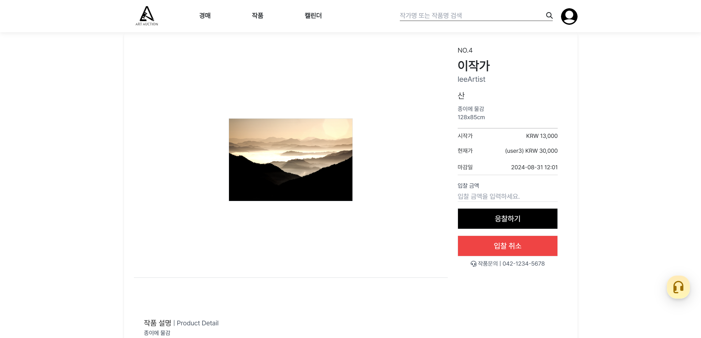

   

# 온라인 미술품 경매 사이트
  
# 🚩 프로젝트 정보
- 웹 URL : https://www.a-auc.art/
- DB PORT : 3306
- DB username : root
- 데이터베이스 이름 : ArtAuction_db

# 💬 프로젝트 설명
- 미술 작품을 온라인에서 경매를 통해 구매(입찰)/판매 하는 기능 제공
- 검증된 아티스트와 손수 작업된 작품을 전시하고 소장을 위한 경매 제공
- 투명한 경매, 공정한 거래, 안전한 작품 이전을 목표로 둠

# 💨 개발 기간
- 2024 7.15 ~ 2024 9.3

# 👥 개발 팀원
|                                                               **임재원**                                                               |                                                                **박지완**                                                                |                                                               **김민섭**                                                                |                                                               **김채연**                                                                |
|:-----------------------------------------------------------------------------------------------------------------------------------:|:-------------------------------------------------------------------------------------------------------------------------------------:|:------------------------------------------------------------------------------------------------------------------------------------:|:------------------------------------------------------------------------------------------------------------------------------------:|
| [   @maegon](https://github.com/maegon) | [   @tron0318](https://github.com/tron0318) | [   @kimminseop99](https://github.com/kimminseop99) | [   @kim-chaeyeon](https://github.com/kim-chaeyeon) |

# 🛠 개발 환경
- 운영체제 : Windows 10, 11
- 통합개발환경(IDE) : IntelliJ
- JDK 버전 : JDK 21
- 데이터 베이스 : MySQL
- 빌드 툴 : Gradle
- 관리 툴 : GitHub
- 배포 툴 : Nginxproxymanager, Termius

# ✨ Dependencies
- Spring Boot DevTools
- Lombok
- Spring Data JPA
- MariaDB Driver
- Spring Security
- Spring Web
- Oauth2-client
- Thymeleaf
- Validation
- spring boot starter mail
- Toss Payments
- daumcdn 주소 찾기(다음 카카오 API)

# 💻 기술 스택

### Version Control

    
    

### Backend Technologies

    
    
    
    

### Frontend Technologies

    
    
    
    
    
    
    

### Databases

    
    

# ER 다이어그램

# 사용자 요구사항 명세서

# 주요 기능

   
🖼️ 경매 기능

    

   ### 1. 작가가 자신의 작품을 경매에 내놓기 위해 관리자에게 경매 신청을 합니다.
   
     

   ### 2. 관리자는 신청된 작품을 보고 검수합니다.
   
     

   ### 3. 검토가 완료되면 관리자는 해당 제품을 경매에 내놓습니다.
   
     

   ### 4. 사용자는 경매 페이지에서 진행 중인 경매 작품들을 확인할 수 있습니다.
   
     

   ### 5. 경매 응찰을 하기 전 (다른 사용자가 이미 입찰 금액을 제시한 상황)
   
     

   ### 6. 경매 응찰을 하고 난 후
   
     

   ### 7. 사용자의 마이페이지에서 경매 입찰 목록을 확인할 수 있습니다.
   
     

   ### 8. 경매가 종료되고 낙찰자로 선정이 되면 낙찰 목록에서 확인할 수 있습니다.
   
     

   
🔔 알림 기능

    

  -  

      
📨 경매 관련 알림 설정 및 시작 알림

       

      ### 1. 사용자는 예정된 경매의 상세 페이지에서 알림 설정을 할 수 있습니다.
      
        

      ### 2. 사용자의 개인 메일로 경매 시작 1시간 전 경매 시작 알림 메일이 발송됩니다.
      
        
      
     

 -   

      
🎉 경매 결과 알림

       

      ### 1. 해당 작품의 작가에게 축하 메일이 발송됩니다.
      
        

      ### 2. 해당 작품을 낙찰한 낙찰자에게 축하 메일이 발송됩니다.
      
        

      ### 3. 낙찰하지 못했지만 해당 작품의 경매에 참여한 참여자들에게 결과 알림 메일이 발송됩니다.
      
        
   

   
👩‍🎨 작가 권한 부여

    
    
   ### 1. 사용자는 작가의 권한을 받기 위해 작가 신청을 할 수 있습니다.(이용약관 동의 및 증빙 자료 제출은 필수!!)
   
     

   ### 2. 신청을 완료하면 관리자의 승인을 기다립니다.
   
     

   ### 3. 관리자는 작가 신청 내역에서 증빙 자료를 확인하고 작가 승인을 허가해 줄 수 있습니다.
   
     

   ### 4. 이 후 관리자는 회원 권한 설정 페이지에서 해당 회원에 작가의 권한을 부여해줄 수 있습니다.
   
     

   ### 5. 작가권한을 받은 사용자는 작가 프로필을 생성할 수 있습니다.
   
     

   ### 6. 작가 프로필을 생성하고나면 작가 개인 페이지가 생성됩니다.
   
     

   ### 7. 작가는 자신의 작품을 등록할 수 있습니다.(작가 프로필을 생성 후 작품 등록 가능!!)
   
     

# 역할 분담
### 임재원
+ UI, 페이지
  - 로그인, 회원가입, 계정찾기(아이디 찾기, 비밀번호 찾기)
  - 관리자(경매 내역 관리, 신청된 경매 작품 확인, 회원 권한 설정)
+ 기능
  - 소셜 계정으로 로그인 기능
  - 회원가입을 통한 로그인
  - 회원 가입 시 이메일 인증, 카카오 API를 통한 주소 입력
  - 이메일 발송을 통한 아이디 찾기
  - 이메일 발송을 통한 임시 비밀번호 발급(비밀번호 찾기)
  - 경매 내역 리스팅 및 관리
  - 작가가 신청한 작품 리스팅 및 관리
  - 회원 리스팅 및 관리
  - 회원의 권한(role)을 관리자가 변경하여 관리(role 값은 admin, artist, member로 나뉨)

### 박지완
+ UI, 페이지
  - 마이페이지 (회원정보, 정보수정, 찜, 입찰내역, 낙찰내역, 문의내역)
  - 문의, FAQ(자주찾는질문)
  - 관리자(자주찾는질문 관리, 고객문의관리)
  - 회사소개
+ 기능
  - 정보수정(회원 정보,배송지수정)
  - FAQ(자주찾는질문 생성, 삭제, 리스팅 (관리자만가능))
  - 문의하기,답변(고객이 문의를하면 관리자가 답변하는방식)
  - 찜 기능(작품옆에 하트버튼을누르면 색이채워져 관심상품으로 확인)
  - 채팅(channel.io Api 를 이용해 고객과 상담사(관리자) 실시간채팅구현)
  - 마이페이지 리스팅
    - 입찰내역(입찰한상품의 가격정보,나의입찰 가격정보 확인 경매중이면 경매중 경매종료면 낙찰여부확인가능)
    - 낙찰내역(낙찰성공한 상품의 정보확인후 주문페이지로 이동가능)
    - 문의내역(자신이 문의한 내역,관리자가 답변을하면 처리완료로 상태변경)
    - 찜(자신의 관심상품 나열)
  

### 김민섭
+ UI, 페이지
  - 메인(잔행중인 경매, 예정된 경매, 추천 작가, 가이드)
  - 헤더(경매, 작품, 캘린더, 검색)
  - 푸터
  - 그림판
  - 충전
  - 상세내역(주문, 배송, 작품, 진행중인 경매, 예정된 경매)
  - 경매 가이드(howToBuy, howToSell)
  - 예정된 경매 
  - 관리자(경매 추가)
  - 작가(작품 추가)
  - 검색
+ 기능
  - 캘린더 (fullcalendar API 사용)
  - 경매(경매 응찰, 응찰 취소, 낙찰)
  - 알림(예정된 경매 1시간전 알림메일, 경매가 끝난 후 작가, 낙찰자, 응찰자에게 경매 결과 알림메일)
  - 충전(tossPayment 사용)
  - 검색(작가 및 작품 검색 가능)
  - 그림판(그림 그리기, 저장)

### 김채연
+ UI, 페이지
  - 작가(프로필, 약관 동의 및 작가 신청, 작가 리스트, 즐겨찾기)
  - 작품(개인 작품 리스트, 경매 등록 신청)
  - 관리자(작가 신청 승인, 경매 작품 등록 승인, 승인 리스트 관리)
+ 기능
  - 프로필(승인 후 프로필 작성 가능, 입력 필드 추가, 개인 작품 리스트로 이동)
  - 약관 동의(작가신청- 증빙 파일 업로드 및 승인 요청)
  - 작가 리스트 및 즐겨찾기 관리(작가 리스트에서 즐겨찾기 추가/취소 시 즐겨찾기한 작가 리스트에 자동 반영)
  - 개인 작품 리스트(해당 작가의 작품만 조회 가능, 작가- 자신의 작품만 경매 등록 버튼 표시)
  - 작품 경매 신청(경매 신청 시 버튼이 사라짐)
  - 승인 리스트(작가 및 경매 작품 승인/거절 관리)
    - 작가 승인 리스트(승인하면 승인 완료 목록에 작가가 뜸)
    -  경매 신청 작품 승인 리스트(경매 작품을 거절하면 해당 작품은 삭제됨)
